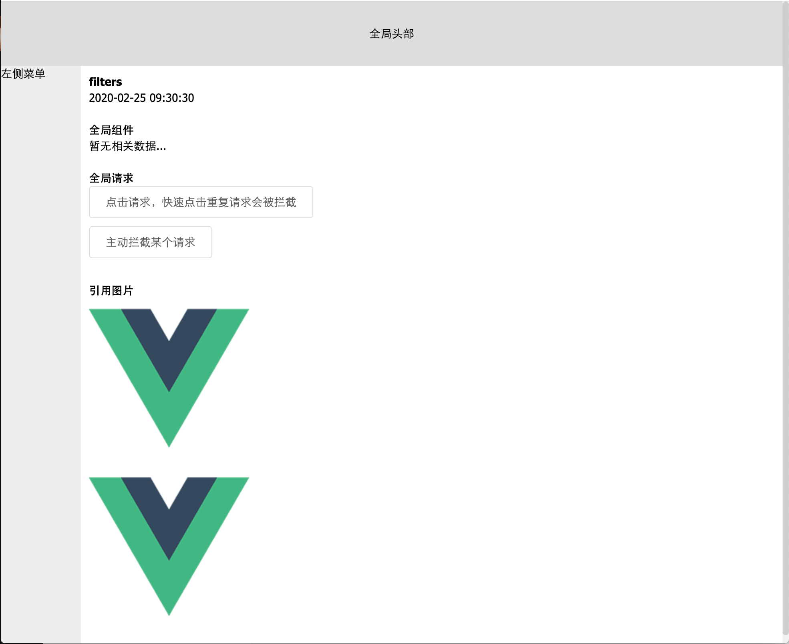

# fed-vue-init 初始化一个结构清晰的vue项目，适用初学者，从0到1的vue项目
### css 命名规则
```
布局（grid）（.g-）：将页面分割为几个大块，通常有头部、主体、主栏、侧栏、尾部等！
模块（module）（.m-{模块名}）：通常是一个语义化的可以重复使用的较大的整体！比如导航、登录、注册、各种列表、评论、搜索等！
元件（unit）（.u-）：通常是一个不可再分的较为小巧的个体，通常被重复用于各种模块中！比如按钮、输入框、loading、图标等！
功能（function）（.f-）：为方便一些常用样式的使用，我们将这些使用率较高的样式剥离出来，按需使用，通常这些选择器具有固定样式表现，比如清除浮动等！不可滥用！
皮肤（skin）（.s-）：如果你需要把皮肤型的样式抽离出来，通常为文字色、背景色（图）、边框色等，非换肤型网站通常只提取文字色！非换肤型网站不可滥用此类！
状态（.z-）：为状态类样式加入前缀，统一标识，方便识别，她只能组合使用或作为后代出现（.u-ipt.z-dis{}，.m-list li.z-sel{}），具体详见命名规则的扩展相关项。
JS  （.js-）：为js绑定加入前缀，统一标识，方便识别，她只能用于绑定js相关内容，不做任务样式绑定！
```

### 目录结构
```
- public            
  - index.html
- src               // vue主目录
  - api             // api
    - index.js          // api map
  - assets          // 主静态资源目录
    - iconfont          // iconfont
    - images            // images
    - style             // less、scss、css
      - index.less          // 主入口
  - components      // 全局通用组件
    - x-empty            // 命名规则：以单字母或者3字母内开头，使用`-`代替驼峰命名；例：x-null
    - index.js          // 导出所有全局组件
  - router          // 路由
    - async.js          // 异步路由，用户登录成功后加载的，做权限用
    - index.js          // 入口文件
    - static.js         // 静态路由，默认可以访问的 
  - store           // vuex
    - modules           // 新vuex modules
      - app.js              // 对modules进行分类，namespaced: true；调用方式store.dispatch('app/setLoading', true)
      - index.js            // 导出modules
      - user.js            // 用户信息
    - getters.js        // 选择性导出业务所需 state
    - index.js      // 导出
  - utils           // 工具目录
    - x-filters.js        // 全局过滤器
    - x-request.js        // 全局http请求，this.$http({})
  - views           // views
    - layout            // 业务页面主框架
      - components          // 业务私有组件，组件命名规则：以单字母或者3字母内开头，带上业务名称，使用`-`代替驼峰命名；例：x-layout-header
  App.vue   // vue主文件
  main.js   // 项目入口文件
README.md           // 项目概述
```

## 环境安装

### node npm 
`https://nodejs.org/zh-cn/` 选择稳定版即可(node v12.x)

### npm 切镜像
全局安装 `nrm` 快捷切换npm镜像 `https://www.npmjs.com/package/nrm`

`npm i nrm -g`

`nrm ls` 切换到 `taobao`


## Project setup
```
npm install
```

### Compiles and hot-reloads for development
```
npm run serve
```

### Compiles and minifies for production
```
npm run build
```

### Run your tests
```
npm run test
```

### Lints and fixes files
```
npm run lint
```



### Customize configuration
See [Configuration Reference](https://cli.vuejs.org/config/).
